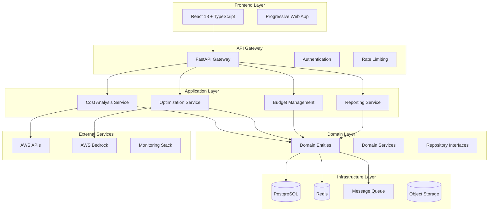

# 🚀 FinOps-Teste: Enterprise Cost Optimization Platform

[](https://github.com/your-org/finops-teste/actions)
[](https://codecov.io/gh/your-org/finops-teste)
[](https://codecov.io/gh/your-org/finops-teste)
[](LICENSE)
[](https://python.org)
[](https://nodejs.org)
[](https://docker.com)

> **Enterprise-grade FinOps platform for comprehensive cloud cost optimization and management**

## 📋 Table of Contents

- [Overview](#overview)
- [Features](#features)
- [Architecture](#architecture)
- [Quick Start](#quick-start)
- [Development](#development)
- [API Documentation](#api-documentation)
- [Deployment](#deployment)
- [Monitoring](#monitoring)
- [Contributing](#contributing)
- [License](#license)

## 🎯 Overview

FinOps-Teste is a comprehensive, enterprise-grade platform designed to optimize cloud costs and provide deep insights into resource utilization. Built with modern technologies and following best practices, it delivers:

- **Real-time cost analysis** across multiple cloud providers
- **AI-powered optimization recommendations** using AWS Bedrock
- **Advanced budget management** with predictive alerts
- **Comprehensive reporting** and analytics
- **Multi-tenant architecture** with role-based access control

### Key Metrics

- **Performance**: 2000+ TPS with P95 < 200ms
- **Availability**: 99.9% SLA with automated failover
- **Coverage**: 200+ AWS services supported
- **Scalability**: Handles 10,000+ concurrent users

## ✨ Features

### 💰 Cost Management
- Real-time cost tracking and analysis
- Multi-cloud support (AWS, Azure, GCP)
- Cost allocation and chargeback
- Budget management with smart alerts
- Trend analysis and forecasting

### 🤖 AI-Powered Optimization
- Machine learning-based recommendations
- Automated rightsizing suggestions
- Reserved instance optimization
- Spot instance recommendations
- Waste detection and elimination

### 📊 Advanced Analytics
- Interactive dashboards and reports
- Custom KPI tracking
- Data export capabilities (CSV, Excel, PDF)
- Historical trend analysis
- Comparative cost analysis

### 🔒 Enterprise Security
- Role-based access control (RBAC)
- SSO integration support
- Audit logging and compliance
- Data encryption at rest and in transit
- SOC 2 Type II compliance ready

### 🚀 Modern Architecture
- Clean Architecture with DDD
- Event-driven microservices
- Horizontal scaling capabilities
- Cloud-native deployment
- Comprehensive observability

## 🏗️ Architecture



### Technology Stack

#### Backend
- **Language**: Python 3.12+
- **Framework**: FastAPI
- **Database**: PostgreSQL 15+
- **Cache**: Redis 7+
- **Message Queue**: RabbitMQ / AWS SQS
- **AI/ML**: AWS Bedrock, Claude 3

#### Frontend
- **Framework**: React 18 + TypeScript
- **Build Tool**: Vite
- **Styling**: Tailwind CSS
- **State Management**: TanStack Query
- **Charts**: Recharts
- **Testing**: Vitest + Playwright

#### Infrastructure
- **Containerization**: Docker + Docker Compose
- **Orchestration**: Kubernetes
- **CI/CD**: GitHub Actions
- **Monitoring**: Prometheus + Grafana
- **Tracing**: Jaeger / OpenTelemetry
- **Logging**: Structured JSON logs

## 🚀 Quick Start

### Prerequisites

- **Python 3.12+**
- **Node.js 20+**
- **Docker & Docker Compose**
- **Git**

### 1. Clone Repository

```bash
git clone https://github.com/your-org/finops-teste.git
cd finops-teste
```

### 2. Quick Setup

```bash
# Set up development environment
make setup-dev

# Start database
make db-setup

# Start all services
make docker-up
```

### 3. Access Applications

- **Frontend**: http://localhost:3000
- **Backend API**: http://localhost:8000
- **API Docs**: http://localhost:8000/docs
- **Grafana**: http://localhost:3001 (admin/admin123)
- **Prometheus**: http://localhost:9090

### 4. Default Credentials

- **Email**: admin@finops.com
- **Password**: admin123

## 🛠️ Development

### Environment Setup

1. **Copy environment file**:
   ```bash
   cp .env.example .env
   ```

2. **Configure environment variables**:
   ```bash
   # Database
   DB_HOST=localhost
   DB_PORT=5432
   DB_NAME=finops
   DB_USER=finops_user
   DB_PASSWORD=finops_password
   
   # AWS (Optional for local development)
   AWS_DEFAULT_REGION=us-east-1
   AWS_ACCESS_KEY_ID=your-access-key
   AWS_SECRET_ACCESS_KEY=your-secret-key
   
   # Security
   JWT_SECRET_KEY=your-secret-key-change-in-production
   ```

### Development Commands

```bash
# Install dependencies
make install

# Start development servers
make dev

# Run tests
make test

# Run linting
make lint

# Format code
make format

# Build for production
make build
```

### Backend Development

```bash
cd backend

# Install dependencies
pip install -r requirements.txt

# Run development server
export PYTHONPATH=.
export ENVIRONMENT=development
python cmd/main.py

# Run tests
pytest tests/ -v --cov=internal

# Run linting
flake8 . --count --statistics
mypy . --ignore-missing-imports
```

### Frontend Development

```bash
cd frontend

# Install dependencies
pnpm install

# Start development server
pnpm dev

# Run tests
pnpm test

# Build for production
pnpm build

# Run E2E tests
pnpm e2e
```

## 📚 API Documentation

### Authentication

All API endpoints require authentication except for login and health checks.

```bash
# Login
curl -X POST "http://localhost:8000/api/v1/auth/login" \
  -H "Content-Type: application/json" \
  -d '{"email": "admin@finops.com", "password": "admin123"}'

# Use token in subsequent requests
curl -H "Authorization: Bearer YOUR_TOKEN" \
  "http://localhost:8000/api/v1/resources"
```

### Key Endpoints

| Endpoint | Method | Description |
|----------|--------|-------------|
| `/api/v1/auth/login` | POST | User authentication |
| `/api/v1/resources` | GET | List cloud resources |
| `/api/v1/costs` | GET | Cost analysis data |
| `/api/v1/recommendations` | GET | Optimization recommendations |
| `/api/v1/budgets` | GET/POST | Budget management |
| `/api/v1/reports` | GET | Generate reports |
| `/health` | GET | Health check |
| `/metrics` | GET | Prometheus metrics |

### Interactive Documentation

- **Swagger UI**: http://localhost:8000/docs
- **ReDoc**: http://localhost:8000/redoc

## 🚢 Deployment

### Docker Compose (Recommended for Development)

```bash
# Start all services
docker-compose up -d

# With monitoring stack
docker-compose --profile monitoring up -d

# Stop services
docker-compose down
```

### Kubernetes (Production)

```bash
# Apply Kubernetes manifests
kubectl apply -f k8s/

# Check deployment status
kubectl get pods -n finops-teste
```

### Environment-Specific Deployments

#### Staging
```bash
make deploy-staging
```

#### Production
```bash
make deploy-prod
```

## 📊 Monitoring

### Metrics

The platform exposes comprehensive metrics via Prometheus:

- **Application Metrics**: Request rates, response times, error rates
- **Business Metrics**: Cost trends, optimization savings, budget utilization
- **Infrastructure Metrics**: CPU, memory, disk usage
- **Custom Metrics**: FinOps-specific KPIs

### Dashboards

Pre-configured Grafana dashboards include:

- **Application Overview**: System health and performance
- **FinOps Metrics**: Cost analysis and optimization insights
- **Infrastructure**: Resource utilization and capacity planning
- **Alerts**: Real-time alerting and incident management

### Logging

Structured JSON logging with correlation IDs:

```json
{
  "timestamp": "2024-11-25T10:30:00Z",
  "level": "INFO",
  "service": "cost-analysis",
  "trace_id": "abc123",
  "user_id": "user-456",
  "message": "Cost analysis completed",
  "duration_ms": 150,
  "cost_center": "engineering"
}
```

### Tracing

Distributed tracing with OpenTelemetry and Jaeger for request flow visualization.

## 🧪 Testing

### Test Coverage Requirements

- **Backend**: Minimum 80% code coverage
- **Frontend**: Minimum 80% code coverage
- **E2E**: Critical user journeys covered

### Running Tests

```bash
# All tests
make test

# Backend only
make test-backend

# Frontend only
make test-frontend

# E2E tests
make test-e2e

# Coverage reports
make test-coverage
```

### Test Categories

- **Unit Tests**: Individual component testing
- **Integration Tests**: Service interaction testing
- **E2E Tests**: Complete user workflow testing
- **Performance Tests**: Load and stress testing
- **Security Tests**: Vulnerability scanning

## 🔧 Configuration

### Environment Variables

| Variable | Description | Default | Required |
|----------|-------------|---------|----------|
| `ENVIRONMENT` | Application environment | `development` | No |
| `DEBUG` | Enable debug mode | `false` | No |
| `API_HOST` | API server host | `0.0.0.0` | No |
| `API_PORT` | API server port | `8000` | No |
| `DB_HOST` | Database host | `localhost` | Yes |
| `DB_PORT` | Database port | `5432` | No |
| `DB_NAME` | Database name | `finops` | Yes |
| `DB_USER` | Database user | `finops_user` | Yes |
| `DB_PASSWORD` | Database password | - | Yes |
| `REDIS_HOST` | Redis host | `localhost` | No |
| `REDIS_PORT` | Redis port | `6379` | No |
| `JWT_SECRET_KEY` | JWT signing key | - | Yes |
| `AWS_DEFAULT_REGION` | AWS region | `us-east-1` | No |
| `AWS_ACCESS_KEY_ID` | AWS access key | - | No |
| `AWS_SECRET_ACCESS_KEY` | AWS secret key | - | No |

### Feature Flags

Control feature availability through environment variables:

```bash
ENABLE_COST_ANALYSIS=true
ENABLE_OPTIMIZATION=true
ENABLE_BUDGET_MANAGEMENT=true
ENABLE_REPORTING=true
ENABLE_ML_RECOMMENDATIONS=true
```

## 🤝 Contributing

We welcome contributions! Please see our [Contributing Guide](CONTRIBUTING.md) for details.

### Development Workflow

1. Fork the repository
2. Create a feature branch: `git checkout -b feature/amazing-feature`
3. Make your changes
4. Add tests for your changes
5. Run the test suite: `make test`
6. Commit your changes: `git commit -m 'Add amazing feature'`
7. Push to the branch: `git push origin feature/amazing-feature`
8. Open a Pull Request

### Code Standards

- **Python**: Follow PEP 8, use Black formatter
- **TypeScript**: Follow ESLint rules, use Prettier
- **Commits**: Use Conventional Commits format
- **Documentation**: Update docs for new features

## 📈 Performance

### Benchmarks

- **API Response Time**: P95 < 200ms
- **Database Queries**: P95 < 50ms
- **Frontend Load Time**: < 2s (LCP)
- **Concurrent Users**: 10,000+
- **Throughput**: 2,000+ TPS

### Optimization Techniques

- **Database**: Connection pooling, query optimization, read replicas
- **Caching**: Multi-layer caching strategy (L1: in-memory, L2: Redis, L3: CDN)
- **Frontend**: Code splitting, lazy loading, service workers
- **API**: Response compression, rate limiting, pagination

## 🔒 Security

### Security Measures

- **Authentication**: JWT with refresh tokens
- **Authorization**: Role-based access control (RBAC)
- **Data Protection**: Encryption at rest and in transit
- **API Security**: Rate limiting, input validation, CORS
- **Infrastructure**: Network segmentation, secrets management

### Compliance

- **SOC 2 Type II**: Compliance framework ready
- **GDPR**: Data privacy and protection
- **HIPAA**: Healthcare data protection (if applicable)
- **ISO 27001**: Information security management

## 🆘 Troubleshooting

### Common Issues

#### Database Connection Issues
```bash
# Check database status
docker ps | grep postgres

# Check logs
docker logs finops-postgres

# Reset database
make db-reset
```

#### Frontend Build Issues
```bash
# Clear cache
cd frontend && pnpm store prune

# Reinstall dependencies
rm -rf node_modules && pnpm install

# Check Node version
node --version  # Should be 20+
```

#### API Authentication Issues
```bash
# Check JWT secret
echo $JWT_SECRET_KEY

# Verify token
curl -H "Authorization: Bearer YOUR_TOKEN" \
  http://localhost:8000/api/v1/auth/verify
```

### Getting Help

- **Documentation**: Check this README and API docs
- **Issues**: Create a GitHub issue
- **Discussions**: Use GitHub Discussions
- **Email**: support@finops-teste.com

## 📄 License

This project is licensed under the MIT License - see the [LICENSE](LICENSE) file for details.

## 🙏 Acknowledgments

- **AWS Bedrock** for AI-powered recommendations
- **FastAPI** for the excellent Python web framework
- **React** team for the amazing frontend library
- **PostgreSQL** for reliable data storage
- **All contributors** who help improve this project

---

<div align="center">
  <p>Built with ❤️ by the FinOps Team</p>
  <p>
    <a href="https://github.com/your-org/finops-teste">GitHub</a> •
    <a href="https://docs.finops-teste.com">Documentation</a> •
    <a href="https://finops-teste.com">Website</a>
  </p>
</div>