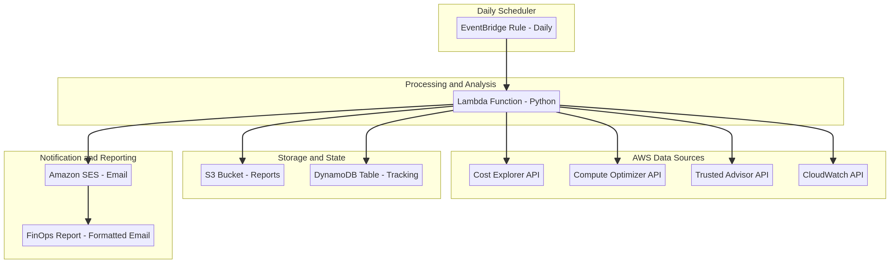

# 📊 Solução Completa de FinOps para AWS (FinOps-GPT)


**Versão 2.0** | **Licença: MIT** | **Autor: Manus AI**

---

## 1. Resumo Executivo

**FinOps-GPT** é uma plataforma **serverless, automatizada e de nível empresarial** projetada para implementar um ciclo completo de FinOps (Financial Operations) na sua conta AWS. A solução executa diariamente para **informar**, **otimizar** e **operar** sua infraestrutura na nuvem com máxima eficiência de custos.

Esta solução vai além de um simples relatório de custos. Ela integra-se com múltiplos serviços da AWS para fornecer **recomendações acionáveis e priorizadas**, permitindo que sua equipe tome decisões baseadas em dados para reduzir o desperdício, otimizar o provisionamento e maximizar o ROI do seu investimento na AWS.

---

## 2. O Problema: O Desafio do Gerenciamento de Custos na Nuvem

A nuvem oferece agilidade e escalabilidade, mas também traz complexidade no gerenciamento de custos. Muitas organizações enfrentam:

- **💸 Desperdício Silencioso**: Recursos ociosos ou subutilizados (EC2, RDS, EBS) que geram custos sem agregar valor.
- **👁️ Falta de Visibilidade**: Dificuldade em atribuir custos a projetos, equipes ou centros de custo específicos.
- **⚙️ Provisionamento Ineficiente**: Uso de instâncias mais caras do que o necessário (*over-provisioning*).
- **📉 Perda de Oportunidades**: Não aproveitar modelos de compra flexíveis como Savings Plans, RIs e Spot Instances.
- **⏳ Processos Manuais**: Análises de custo reativas e manuais que consomem tempo e não escalam.

**FinOps-GPT** ataca esses problemas de frente, automatizando o ciclo de FinOps para transformar a gestão de custos de um processo reativo para uma disciplina proativa e contínua.

---

## 3. Principais Funcionalidades e Produtos Analisados

Esta solução realiza uma varredura completa em sua conta AWS, analisando os seguintes produtos e gerando recomendações específicas:

| Categoria | Produto AWS Analisado | Análise Realizada e Recomendação | Impacto FinOps |
| :--- | :--- | :--- | :--- |
| **Computação** | **Amazon EC2** | - **Right-Sizing**: Recomendações do Compute Optimizer (ex: `t3.large` -> `t3.medium`).<br>- **Subutilização**: Instâncias com CPU < 10% por 7 dias.<br>- **Otimização de Graviton**: Sugestão de migração para instâncias ARM. | Otimização de Recursos |
| | **AWS Lambda** | - **Right-Sizing**: Recomendações de memória do Compute Optimizer.<br>- **Timeout Excessivo**: Funções com timeout muito alto. | Otimização de Recursos |
| | **Amazon ECS** | - **Right-Sizing**: Recomendações de CPU/Memória para tarefas Fargate. | Otimização de Recursos |
| **Banco de Dados** | **Amazon RDS** | - **Subutilização**: Instâncias com CPU e conexões baixas.<br>- **Otimização**: Sugestão de uso do Aurora Serverless para cargas variáveis. | Otimização de Recursos |
| **Armazenamento** | **Amazon S3** | - **Classes de Armazenamento**: Recomenda S3 Intelligent-Tiering para otimização automática.<br>- **Políticas de Lifecycle**: Sugere a criação de políticas de retenção. | Otimização de Recursos |
| | **Amazon EBS** | - **Volumes Ociosos**: Volumes não anexados a nenhuma instância.<br>- **Snapshots Antigos**: Snapshots com mais de 90 dias.<br>- **Otimização de Tipo**: Recomendações do Compute Optimizer (ex: `gp2` -> `gp3`). | Otimização de Recursos |
| **Redes** | **Elastic Load Balancing** | - **Load Balancers Ociosos**: ALBs/NLBs com baixo tráfego. | Otimização de Recursos |
| | **NAT Gateway** | - **Análise de Custo**: Detalhamento do custo por hora e por dados processados. | Visibilidade de Custos |
| | **Elastic IP** | - **IPs Não Associados**: IPs que geram custo sem estarem em uso. | Otimização de Recursos |
| **Modelos de Compra** | **Savings Plans & RIs** | - **Análise de Cobertura**: Verifica o percentual de cobertura de SPs e RIs.<br>- **Recomendações**: Sugere aumentar a cobertura para reduzir custos On-Demand. | Otimização de Preços |
| **Governança** | **Cost Allocation Tags** | - **Análise por Tags**: Agrupa custos por `CostCenter`, `Project`, `Environment`. | Visibilidade e Alocação |
| | **Trusted Advisor** | - **Integração Completa**: Incorpora todas as verificações de otimização de custos. | Melhores Práticas |
| | **Cost Anomaly Detection** | - **Detecção de Anomalias**: Alerta sobre picos de gastos inesperados. | Controle de Custos |

---

## 4. Arquitetura da Solução: Um Deep Dive

A solução é construída sobre uma arquitetura **100% serverless**, garantindo baixo custo, alta disponibilidade e escalabilidade infinita sem a necessidade de gerenciar servidores.



### Fluxo de Trabalho Detalhado:

1.  **Agendamento (Informar)**: Uma regra do **Amazon EventBridge** é configurada com uma expressão cron (`cron(0 8 * * ? *)`) para acionar a função Lambda diariamente às 8h UTC.

2.  **Coleta de Dados (Informar)**: A função **AWS Lambda** (`finops-analyzer`), escrita em Python 3.11 com Boto3, é o cérebro da operação. Ela executa as seguintes chamadas de API em paralelo:
    - `ce:GetCostAndUsage`: Para custos diários e por tags.
    - `ce:GetSavingsPlansCoverage` e `ce:GetReservationUtilization`: Para cobertura de RIs/SPs.
    - `ce:GetAnomalies`: Para anomalias de custo.
    - `compute-optimizer:Get*Recommendations`: Para recomendações de right-sizing.
    - `support:DescribeTrustedAdvisorChecks`: Para verificações do Trusted Advisor.
    - `cloudwatch:GetMetricStatistics`: Para métricas de utilização de EC2, RDS, ELB, etc.
    - `ec2:Describe*`, `rds:Describe*`, `elbv2:Describe*`: Para metadados de recursos.

3.  **Análise e Otimização (Otimizar)**: O código Python processa e correlaciona os dados coletados para gerar insights acionáveis. A lógica de análise é modular e pode ser facilmente estendida.

4.  **Geração de Relatório (Informar)**: Um relatório detalhado em HTML é gerado, contendo:
    - Resumo de custos, previsão e potencial de economia.
    - Gráficos de custo por serviço e por tags.
    - Tabelas de recomendações priorizadas por impacto financeiro.

5.  **Notificação e Operação (Operar)**:
    - O relatório HTML é enviado para uma lista de destinatários via **Amazon SES**.
    - Uma cópia do relatório (HTML) e os dados brutos (JSON) são arquivados em um **Bucket S3** para auditoria e análise de tendências.
    - Cada recomendação gerada é salva em uma tabela do **Amazon DynamoDB** com um status `pending`. Isso permite criar um ciclo de feedback, onde as equipes podem atualizar o status para `implemented` ou `ignored`.

---

## 5. Guia de Implementação (Getting Started)

### Pré-requisitos

- **Conta AWS** com permissões de administrador.
- **AWS CLI** configurado.
- **Amazon SES** com um e-mail ou domínio verificado.
- **AWS Compute Optimizer** ativado na conta (pode levar até 24h para gerar as primeiras recomendações).

### Opção 1: Deploy com CloudFormation (Recomendado)

1.  **Clone o Repositório**:
    ```bash
    git clone https://github.com/FELIPEACASTRO/Finops-Teste.git
    cd Finops-Teste
    ```

2.  **Empacote o Código da Lambda**:
    ```bash
    zip lambda-function.zip lambda_finops_analyzer_v2.py
    ```

3.  **Faça o Deploy da Stack**:
    ```bash
    aws cloudformation deploy \
      --template-file cloudformation-template.yaml \
      --stack-name finops-automation-stack \
      --parameter-overrides \
        EmailFrom="seu-email@verificado.com" \
        EmailTo="destinatario1@exemplo.com,destinatario2@exemplo.com" \
      --capabilities CAPABILITY_NAMED_IAM
    ```

4.  **Atualize o Código da Lambda**:
    ```bash
    aws lambda update-function-code \
      --function-name finops-analyzer \
      --zip-file fileb://lambda-function.zip
    ```

### Opção 2: Deploy Manual

Siga as instruções detalhadas no arquivo `DEPLOY_GUIDE.md`.

---

## 6. Configuração e Personalização

A solução pode ser facilmente personalizada através de variáveis de ambiente na função Lambda:

- `CPU_THRESHOLD`: Limiar de CPU para considerar uma instância EC2/RDS como ociosa (Padrão: `10`%).
- `SNAPSHOT_AGE_DAYS`: Idade em dias para considerar um snapshot EBS como antigo (Padrão: `90`).
- `EMAIL_TO`, `EMAIL_FROM`: Configuração de e-mails.

### Estendendo a Solução

Adicionar uma nova verificação é simples. Exemplo: adicionar uma verificação para **IPs Elásticos não utilizados**:

1.  **Crie a Função de Análise** em `lambda_finops_analyzer_v2.py`:

    ```python
    def get_unattached_elastic_ips() -> List[Dict]:
        unattached_ips = []
        try:
            addresses = ec2_client.describe_addresses()
            for address in addresses["Addresses"]:
                if "AssociationId" not in address:
                    unattached_ips.append({
                        "category": "Elastic IP Ocioso",
                        "resource": address["PublicIp"],
                        "recommendation": "Liberar IP se não estiver em uso",
                        "estimated_monthly_savings": "$3.60"
                    })
        except Exception as e:
            print(f"Erro ao verificar IPs Elásticos: {str(e)}")
        return unattached_ips
    ```

2.  **Chame a Função** no `lambda_handler` e adicione os resultados à lista de recomendações.

---

## 7. Segurança

- **Princípio do Menor Privilégio**: A Role do IAM (`FinOpsLambdaRole`) concede apenas as permissões estritamente necessárias para a execução.
- **Criptografia**: Ative a criptografia em repouso (SSE-S3) no bucket S3 e na tabela do DynamoDB.
- **Controle de Acesso**: O bucket S3 bloqueia todo o acesso público por padrão.
- **Auditoria**: Todas as execuções da Lambda e chamadas de API são registradas no AWS CloudTrail.

---

## 8. Custo de Propriedade (TCO)

A solução é extremamente econômica, operando quase inteiramente dentro do **Nível Gratuito da AWS**.

- **Custo Estimado Mensal**: **~ $0.10 - $0.50**
- **ROI Esperado**: Mesmo uma única recomendação aplicada (ex: downsizing de uma instância `m5.large`) pode gerar uma economia de **$50-100/mês**, resultando em um ROI de mais de **10.000%**.

---

## 9. Contribuições e Licença

Este projeto é de código aberto e licenciado sob a **Licença MIT**. Contribuições são bem-vindas! Sinta-se à vontade para abrir um Pull Request para adicionar novas funcionalidades ou corrigir bugs.

---

## 10. Referências

- [FinOps Foundation](https://www.finops.org/)
- [AWS Cloud Financial Management](https://aws.amazon.com/cloud-financial-management/)
- [AWS Well-Architected Framework - Cost Optimization Pillar](https://docs.aws.amazon.com/wellarchitected/latest/cost-optimization-pillar/cost-optimization-pillar.html)
